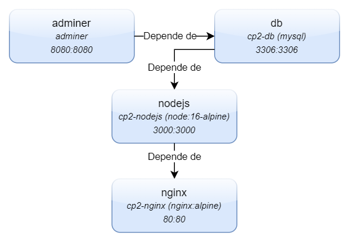

# 👨‍💼 Sistema de Gestão de Funcionários - SGF
## 📝 Descrição
>
> O SGF é um sistema de gestão de funcionários, que tem como objetivo facilitar o gerenciamento do cadastro, atualização e exclusão de funcionários de uma empresa.
> 
> **Este projeto foi idealizado e desenvolvido por:**

|Turma|Nome|RM|
|-|-|-|
|2TDSPG|[Caio Gallo Barreira]()|94526| 
|2TDSPG|[Guilherme Menezes da Silva]()|89384| 
|2TDSPG|[Guilherme Oliveira Rocha]()|94771| 
|2TDSPG|[João Victor de Souza Silva]()|92119| 

## 📚 Tecnologias utilizadas
>  - [Node.js](https://nodejs.org/en/) - Para a criação do servidor;
>  - [Express](https://expressjs.com/pt-br/) - Para a criação da API REST;
>  - [MySQL](https://www.mysql.com/) - Para o armazenamento dos dados;
>  - [Nginx](https://www.nginx.com/) - Para o balanceamento de carga e proxy reverso do servidor web;
>  - [Docker](https://www.docker.com/) - Para a criação de containers;
>  - [Docker Compose](https://docs.docker.com/compose/) - Para o gerenciamento dos containers;

## 🖥️ Estrutura dos containers
>  - **nodejs** - Container que contém o servidor Node.js;
>  - **nginx** - Container que contém o servidor Nginx;
>  - **db** - Container que contém o servidor MySQL;
>  - **adminer** - Container que contém o servidor Adminer (Interface gráfica Web para o MySQL);




## 📂 Estrutura de pastas
>  - **api/** - Pasta que contém os arquivos da API REST;
>  - **nginx/** - Pasta que contém os arquivos de configuração do Nginx;
>  - **nginx/html/** - Pasta que contém os arquivos do servidor web;
>  - **nginx/html/css/** - Pasta que contém os arquivos de estilo do servidor web;
>  - **nginx/html/js/** - Pasta que contém os arquivos de script do servidor web;
>  - **sql/** - Pasta que contém os arquivos de configuração do MySQL;

## 📦 Instalação
>  ### **Pré-requisitos:**
> 
> - [Docker](https://www.docker.com/)
> - [Docker Compose](https://docs.docker.com/compose/)
> 
> ### **Passos:**
>
>  1. Clone o repositório:
>  ```bash
>  git clone
>  ```
>  2. Entre na pasta do projeto:
> ```bash
> cd sgf
> ```
>  3. Execute o comando:
>  ```bash
>  docker-compose up
>  ```
>  4. Acesse o servidor web através do endereço:
>  ```bash
>  http://localhost:8080
>  ```